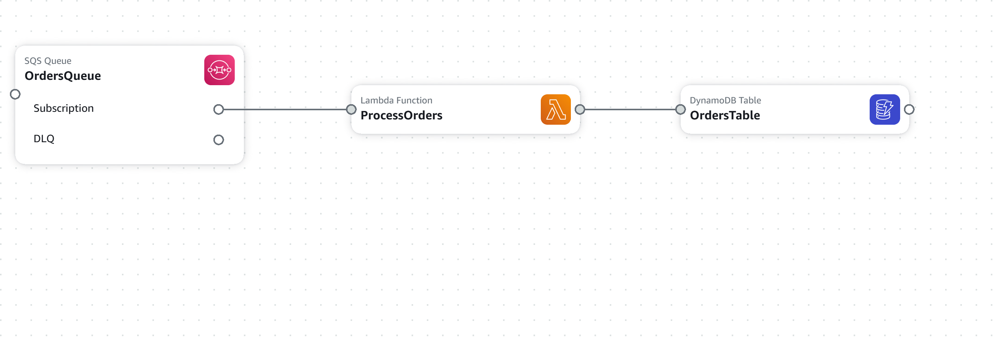
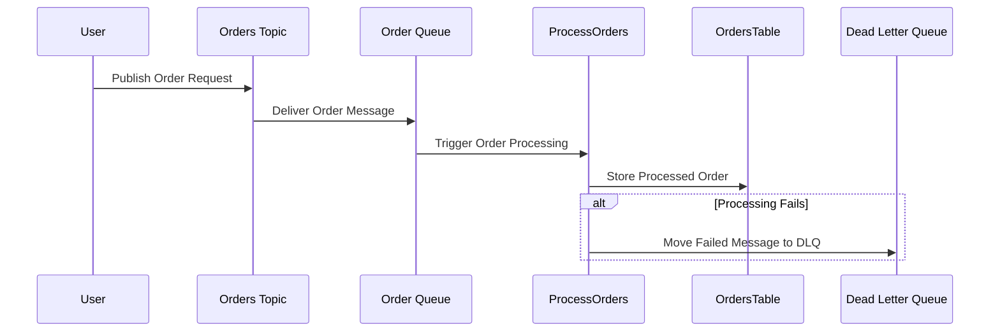

# **System Description**
An AWS-based serverless order processing system using SNS, SQS, Lambda, and DynamoDB. This system processes customer orders using an event-driven architecture. Orders are published to an SNS topic, which sends messages to an SQS Queue (OrderQueue). The Lambda function (ProcessOrders) picks up messages, processes the order, and stores it in a DynamoDB table (OrdersTable). 

---

## **Project Architecture**
### **Architecture Diagram**
  

### **Sequence Diagram of Events**

-> **SNS** publishes order requests.  
-> **SQS** queues messages reliably.  
-> **Lambda** processes each order sequentially.  
-> **DynamoDB** stores finalized order details.

---

## **Setup Guide**
### **Prerequisites**
- AWS Account  
- Optionally Cloud Formation

### Manual Deployment

Create a DynamoDB table:  
1. Open AWS Console → DynamoDB  
2. Click "Create Table"   
3. Set Primary Key → Click "Create"  

Set up an IAM role for Lambda:  
1. Open AWS Console → IAM  
2. Attach `AmazonDynamoDBFullAccess` and `AWSLambdaBasicExecutionRole` 

Deploy Lambda function:  
1. Open AWS Console → Lambda  
2. Click "Create Function" → Name: `Function Name`, Runtime: Node.js 22.x, Handler: `index.handler`  
3. Assign IAM role with permissions

Create an SQS queue:  
1. Open AWS Console → SQS  
2. Click "Create Queue"
3. Set visibility timeout to 30 seconds, enable DLQ
4. Create another Queue and assign it as the DLQ for the one in step 2 

Create an SNS topic:  
1. Open AWS Console → SNS  
2. Click "Create Topic"  

Subscribe SQS to SNS:  
1. Go to `Your Topic Name` → Click "Create Subscription"  
2. Select protocol: SQS → Set endpoint to `Your Queue` ARN  

Attach SQS policy:  
1. Open `OrderQueue` → Edit Access Policy  
2. Add a policy allowing SNS to send messages -> ex:
```json
  {
  "Version": "2012-10-17",
  "Statement": [
    {
      "Sid": "AllowSNS",
      "Effect": "Allow",
      "Principal": {
        "Service": "sns.amazonaws.com"
      },
      "Action": "SQS:SendMessage",
      "Resource": "arn:<YourQueueARN>",
      "Condition": {
        "ArnEquals": {
          "aws:SourceArn": "arn:<YourTopicARN>"
        }
      }
    }
  ]
}
```
Connect SQS to Lambda:  
1. Open Your Lambda Function → Add Trigger  
2. Select SQS → Set queue ARN to your Queue ARN  

Test the integration:  
1. Publish a message:  
   ```sh
   aws sns publish --topic-arn <Your Topic ARN> --message "Test Deployment"
   ```  
2. Check if SQS received it:  
   ```sh
   aws sqs receive-message --queue-url <Your Queue URL> --wait-time-seconds 20
   ```  
3. Verify Lambda processed the message in CloudWatch logs or check the table to see the new order!


### **Deployment Using CloudFormation**
1. Go to AWS Console → CloudFormation  
2. Click "Create Stack" → "With new resources"
3. Upload `cloudformation-template.yaml`  
4. Click Next, configure settings, and Create Stack  
5. Once deployed, verify components in SNS, SQS, Lambda & DynamoDB

---

## **4️Importance of Visibility Timeout & DLQs**
### ** Visibility Timeout**
- Prevents multiple Lambda invocations for the same message.
- Gives Lambda time to process before re-queueing the message.
- Set to 30 seconds to balance retries.

### **Dead Letter Queues (DLQs)**
- Captures failed messages that couldn’t be processed.
- Prevents message loss in high-traffic workflows.
- Allows manual debugging and re-processing.
---
